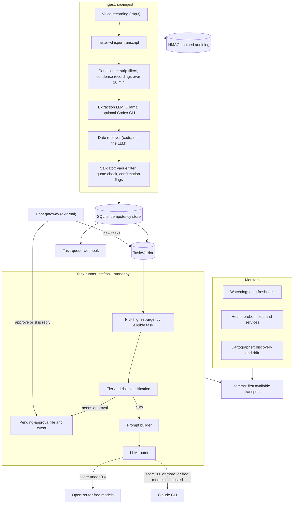

# Odin agent

Odin is a personal task agent I run on a home server. It does two jobs. The task runner takes tasks from TaskWarrior, decides how dangerous each one is, asks a human over chat when the answer is "too dangerous to run alone", and then hands the task to an LLM: a free OpenRouter model for simple work, the Claude CLI for anything complex. The ingest pipeline turns voice recordings into TaskWarrior tasks, with code-side checks that reject items the model invented. Around those two jobs sit monitors (a data-freshness watchdog, a host health probe, a service cartographer) that page only when something changes state. This repository is a sanitized copy published for review; the private deployment wiring is not included.

## Components

| Command | Module | What it does |
|---|---|---|
| `odin-task-runner` | `src/task_runner.py` | Picks one eligible task, gates it by tier and risk, runs it through the LLM router |
| `odin-ingest` | `src/ingest/plaud.py` | Transcribes recordings, extracts action items, validates them, creates tasks |
| `odin-watchdog` | `src/watchdog.py` | Tiered data-freshness alerts, stale-approval expiry, dead-man ping |
| `odin-healthprobe` | `src/healthprobe.py` | Config-driven checks of hosts, units, containers, endpoints, backups |
| `odin-cartographer` | `src/cartographer/` | Discovers services on each host and reports drift against a baseline |

`src/cartographer/launchd_monitor.py` and `src/cartographer/failure_alert.py` are small standalone scripts: one watches macOS LaunchAgents, the other is a systemd `OnFailure=` hook. `src/actions/ha_control.py` is a Home Assistant CLI.

## Architecture



The chat gateway, the timers that start each command, the Postgres schema and the event-intake HTTP service live outside this repository. Every integration with them is optional at runtime: with no database password or intake key set, those writes are skipped with a log line.

## Safety model

All of this is in `src/executor/safety.py` and `src/task_runner.py`.

**Tier** comes from the task description and tags (`detect_tier`):

- `PROD_READONLY` when the text matches a production pattern (`production`, `prod`, `prd`, `live`, `deploy...prod`). With a `+approved` tag the tier becomes `PROD_WRITE`.
- Projects whose profile sets `domain: personal` also get the production tiers when the text names critical infrastructure (VPN, NAS, Home Assistant, n8n, Postgres, `systemctl`, `docker restart`, firewall tools).
- Everything else is `AUTO`.

**Risk** is the first matching class in this order (`classify_task_risk`): `DESTRUCTIVE` (delete, remove, drop, truncate, reset, purge, revert...), `BACKUP_FIRST` (update, modify, fix, migrate, deploy, install, commit, push...), `CONFIRM_APPROACH` (investigate, debug, review, redesign, plan...), `SAFE` (check, list, show, status...). A description that matches nothing is `CONFIRM_APPROACH`.

| Tier | SAFE | BACKUP_FIRST | CONFIRM_APPROACH | DESTRUCTIVE |
|---|---|---|---|---|
| AUTO | runs | runs, with backup rules in the prompt | approval | approval |
| PROD_READONLY | runs with read-only rules | runs with read-only and backup rules | approval | approval |
| PROD_WRITE (`+approved`) | runs with prod-write rules | runs with prod-write and backup rules | approval | approval |

One check runs before the table: a `PROD_READONLY` task whose description also matches a write pattern (deploy, restart, modify, delete, `INSERT`, `UPDATE`...) is not run at all. The runner writes a note, sends "requires +approved tag" with the exact `task <uuid> modify +approved` command, and moves on.

### Approval flow

1. The runner saves `.pending-approval.json` (task, tier, risk, a snapshot of all pending tasks) in its agent directory, posts an `agent.approval_requested` event to the intake service, and sends "Reply 'approve' to execute or 'skip' to decline" through the notification transport. Then it exits.
2. While a request is pending, later runs do not pick new tasks.
3. The reply is handled by the external chat gateway, which marks the file or posts an `agent.approval_resolved` event. Each run checks both.
4. On approval the runner confirms the approved UUID matches the stored task and that TaskWarrior still has it as pending, then executes it. A mismatch discards the approval and says so.
5. A request expires after `tg_approval_timeout_ms` (plus 60 s grace) and always after 24 hours. Independently, the watchdog flags unresolved approval events older than 4 hours and posts an `expired` resolution for anything older than 24.

### Guards during a run

- **One task per run.** An `fcntl` lock file stops overlapping runs; a lock older than 30 minutes counts as stale.
- **Prompt rules.** The prompt carries the tier rules, the backup rules for `BACKUP_FIRST`, and a fixed protocol: stop and annotate `Agent: Unclear` instead of guessing, write a numbered plan that marks each step revertable or irreversible, ask for consent over the gateway's `/ask` endpoint before any irreversible step, and track rollback while executing. It also forbids `rm` (move to Trash instead), `git push`, and touching other tasks.
- **Claude CLI limits.** The subprocess runs with a 4 GB address-space limit, a 64-process limit and a wall-clock timeout (`max_minutes`). Its output is scanned for destructive patterns (`rm -rf /`, `DROP TABLE`, `TRUNCATE`, force pushes, `--hard`, "deleted N rows") and any hit is sent as an alert.
- **Outcome from TaskWarrior, not from the model.** Success means the task's status is `completed` afterwards. An `Agent: Unclear` annotation is reported but not counted as a failure.
- **Circuit breaker.** A task that fails `max_task_failures` times (default 3) is skipped; failure records expire after 48 hours.

## LLM routing

`src/llm/` routes each prompt to the cheapest backend that should handle it.

**Complexity score** (`complexity.py`), clamped to 0..1:

| Signal | Effect |
|---|---|
| Each tag in `critical`, `operator`, `security`, `migration`, `prod_write` | +0.3 |
| Each tag in `confirm`, `followup`, `meeting`, `email`, `demo`, `plaud` | -0.15 |
| Tier `PROD_WRITE` / `PROD_READONLY` | +0.4 / +0.15 |
| Prompt matches of migration, deploy, rollback, schema, refactor, production... | +0.1 each, at most +0.3 |
| Prompt longer than 8,000 characters | +0.15 |

A score of 0.6 or more goes straight to the Claude CLI.

**Free-model rotation** (`router.py`, `models.py`). Below 0.6 the router tries the free OpenRouter models in a fixed best-first order, skipping any model in cooldown, for at most three attempts per request. A 429 puts that model in cooldown for `max(60 s, Retry-After)` multiplied by `1.5^consecutive_failures`, capped at 4x. A 401 or 403 cools the model for an hour, since the key is probably wrong. Other errors cool it for 60 s. A success resets the model's cooldown.

**Claude CLI fallback.** If every attempt fails, or every model is cooling down, the router calls the Claude CLI. With no CLI configured it returns an error result instead of raising. Both backends return the same `LLMResult` shape, so the runner does not care which one answered.

## Ingest: guards against invented tasks

`src/ingest/` assumes the extraction model will sometimes make things up, and checks its output in code.

- **Quote verification** (`validator.py`). Every item must carry a `source_quote`. The quote is checked against the raw transcript: an exact case-insensitive substring passes; otherwise at least 60% of its words must appear in the transcript. Items with no quote, or a quote that fails, are rejected.
- **Confidence gating.** Items below 0.7 confidence are marked `requires_confirmation` with a question attached. Task creation skips items below `auto_create_threshold` (default 0.7) and creates only `task` and `decision` items. Unknown assignees, uncertain dates and `question` items are also flagged; flagged tasks get a `+confirm` tag and a `CONFIRM:` annotation.
- **Vague-item filter.** Exact phrases such as "follow up", "send an email" and "circle back" are rejected, as is anything under three words. Under six words, an item must name something concrete: a number, a capitalized name after the first word, or a term from the configured vocabulary.
- **Deterministic dates** (`date_resolver.py`). The model copies the timing words it heard (`due_raw`) and is told not to convert them. Code resolves "today", "tomorrow", "end of week", "next week", "end of month", weekday phrases ("by Friday", "next Tuesday") and month-day dates against the recording date. Anything else resolves to no date. Each phrase also gets a confidence score, and a date below 0.5 confidence is flagged for confirmation.
- **Idempotency store** (`src/infra/idem_store.py`). A SQLite table keyed on a hash of recording id, normalized description, due date and item type. Re-processing a recording creates nothing new, for TaskWarrior and for the task-queue webhook alike.

Two smaller guards: LLM-supplied tags outside the configured vocabulary are dropped, and each stage appends to an append-only JSONL audit log where every line is HMAC-signed and chained to the hash of the previous line. The audit code refuses to run without `ODIN_AUDIT_KEY` rather than fall back to a default key.

## Quickstart

Requires Python 3.11+ and [uv](https://docs.astral.sh/uv/).

```bash
uv sync                                   # runtime deps plus the dev group (pytest, ruff, mypy)
uv run pytest -q                          # offline unit tests plus the ingest dry run
uv run python -m tests.test_pipeline_e2e  # same dry run, with each stage printed
```

The dry run feeds a simulated seven-item extraction through date resolution, validation, the idempotency store and the audit log. Two items are rejected: "Update the documentation" as too vague, and a ghost item whose quote is not in the transcript. A second pass over the same items creates nothing.

To run the real components:

```bash
cp .env.example .env          # fill in what you use, then: set -a; . ./.env; set +a
cp config/settings.example.yaml config/settings.yaml   # optional: the example is used if absent
cp config/hosts.example.yaml config/hosts.yaml         # for the health probe and cartographer

uv run odin-ingest recording.mp3 --create-tasks   # needs Ollama with the configured model, and TaskWarrior
uv run odin-task-runner                           # needs TaskWarrior and the Claude CLI or an OpenRouter key
uv run odin-healthprobe --quiet
uv run odin-cartographer --scan-only --summary
```

The task runner does nothing until `<agent_dir>/.enabled` exists. It only considers pending tasks tagged `+odin` (or `+operator`) in the projects listed in `all_projects`. The live OpenRouter checks in `tests/scripts/` are excluded from `pytest` and run by hand: `uv run python -m tests.scripts.test_router_live`.

## Configuration

Each config file has a committed `*.example.yaml` and an optional local copy that is gitignored. Code reads the local copy when it exists, otherwise the example (`src/config.py`).

| File | Override | Used by |
|---|---|---|
| `config/settings.yaml` | `ODIN_SETTINGS` | transports, ingest, vocabulary, TaskWarrior, task runner |
| `config/hosts.yaml` | `ODIN_HOSTS` | health probe, cartographer, intermittent-host handling |
| `config/known_services.yaml` | `ODIN_KNOWN_SERVICES` | cartographer baseline (missing file means an empty baseline) |
| `config/context/` | none | optional per-project context docs and `servers.yaml` for the prompt |

Main `settings.yaml` sections:

- `transports`: ordered list of `telegram`, `whatsapp`, `imessage`, `push`. Messages go to the first one whose availability check passes.
- `ingest.plaud`: output directory, Whisper model, Ollama model and URL, optional Codex CLI extraction (looked up on `PATH`).
- `vocabulary`: `projects` (known project names, routed to the work domain), `systems` (names that make a short item concrete), `tag_domains` (queue domain to tags). The extraction prompt, the vague filter, the tag allow-list and the queue routing all read this one block.
- `taskwarrior`: executable, auto-create threshold, default project, tags added to every created task.
- `task_runner`: agent directory, state file, time budget, failure limit, approval timeout, `all_projects`, `project_context`, and `project_profiles`. A profile sets `domain`, `work_dir`, `context_file`, `persona`, an optional `watch_repo` (warn if a run leaves uncommitted changes) and an optional `ssh_connectivity_test` (probe a server before tasks that match a regex).

`hosts.yaml` is documented inline in the example. Every environment variable the code reads is listed in `.env.example` with a placeholder value.

## Design lessons

**Dead-man switches.** The watchdog treats the absence of success as the signal. Each backup leg writes its freshness stamp only after a successful run, so a stale stamp means the backup failed, the target was off, or the scheduler never fired; the same alert covers all three. Backup domains are `CRITICAL` because a `HIGH` domain only pages when three are stale at once, which once let a failed backup get logged as "below threshold" and go unseen. The watchdog also pings an external healthcheck URL on every completed run, so a dead alert channel or a watchdog that stopped running pages from outside. The incident mute switch (`src/comms/mute.py`) has a TTL capped at 24 hours, checked on read, and never silences callers that pass `deadman=True`.

**Alert on transitions, not on states.** A monitor that pages every time it sees a broken thing gets muted. The watchdog records `alerted_at` per domain, escalates once at three times the threshold, and sends a recovery notice. The health probe compares each run with the previous run's failures, applies a one-hour cooldown per check against flapping, and folds symptoms under a root cause: a host that is down swallows its own checks, and a dead reverse proxy swallows the domain checks it fronts. Suppressed symptoms are not stored as "seen", so if they outlive the root cause they page on the next run. The launchd monitor pages after three consecutive failed runs, counted from launchd's own run counter rather than from observations, and re-baselines when that counter goes backwards after a reboot.

**Check outcomes, not liveness.** Two checks exist because a green `/health` hid a broken service. One sends a real recall request and fails on anything but a 200 inside the deadline. The other reads a chat bridge's session status: a dropped session fails only if messages flowed in the last seven days, so a session that is known to be dead does not page every 15 minutes, and the check re-arms itself once traffic resumes.

## Limitations

- **Risk classification is keyword regex over the description.** It is cheap and predictable, and it is also blunt: "Send the deliverable to the client" lands in `PROD_READONLY` because "deliverable" contains "live"; "Clean up the README" is `DESTRUCTIVE`; "Restart prod api" matches no risk pattern and falls back to `CONFIRM_APPROACH`.
- **The Claude CLI runs with `--dangerously-skip-permissions`.** The real gates are the tier and risk checks before the run, the resource limits and the timeout. The consent step for irreversible actions is a prompt instruction, not something the code enforces.
- **Complexity is scored over the full built prompt.** The task-runner template contains words like "production" and "deploy" in its safety rules, which add 0.3 to every task. `AUTO` and `PROD_READONLY` tasks still score under 0.6 and go to free chat models. Those return text and cannot run shell commands or `task done`, so such runs are recorded as not completed. The router fits text-only jobs better than shell execution today.
- **Router cooldowns live in memory.** Each task-runner run is a new process, so cooldowns reset between runs. The free-model list is hardcoded in `src/llm/models.py` and goes stale: during this export two of the eight IDs answered 404 "unavailable for free".
- **Tests are concentrated in `src/llm/` and the ingest dry run.** Of the 63 tests, 62 cover the LLM layer and one runs the ingest pipeline end to end with simulated extraction. The safety classifier, task runner, watchdog, health probe and cartographer have no tests, including `_correlate_root_causes`, which is written as a pure function for that purpose.
- **Scheduling and approval replies are external.** Timers and LaunchAgent plists, the chat gateway, the Postgres schema (`ops.check_data_freshness()`, `core.events`, `ops.agent_traces`) and the intake service are not in this repository.
- **Ingest edges.** Extraction reads at most 24,000 characters of transcript. On recordings over 10 minutes the model sees a condensed transcript while quotes are checked against the raw one, so paraphrased quotes are rejected; this errs toward dropping items. Non-English recordings are transcribed and saved, but nothing is extracted from them. Whisper runs on CPU with int8 weights.

## Repository layout

```
src/
  task_runner.py        task runner entry point
  executor/             tier and risk rules, prompt builder, Claude CLI runner
  llm/                  complexity score, free-model registry, OpenRouter client, router
  ingest/               transcription, conditioning, extraction, date resolver, validator
  actions/              TaskWarrior, task-queue webhook, Home Assistant
  comms/                notification transports and the mute switch
  infra/                audit log, idempotency store, circuit breaker, lock file, DB, memory
  watchdog.py           data-freshness watchdog
  healthprobe.py        host health probe
  cartographer/         service discovery, drift, launchd monitor, failure hook
config/                 *.example.yaml templates
tests/                  unit tests and the ingest dry run; tests/scripts holds live checks
```

## License

Copyright (c) 2026 Ahmed Arafa. All rights reserved. Source is published for review; no license is granted.
